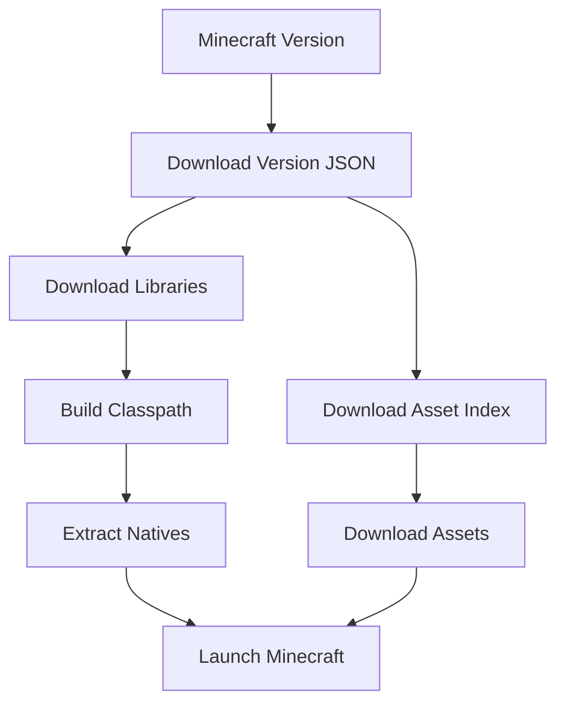
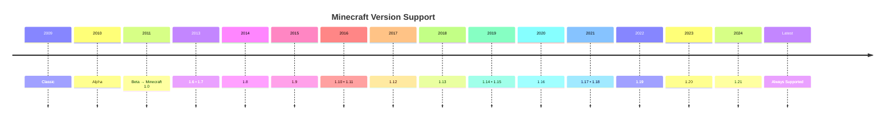

# 🎮 Flystarts Minecraft Launcher


A lightweight **PowerShell-based offline Minecraft launcher** that automatically downloads the required Minecraft files directly from Mojang and launches any supported version.

Inspired by the simplicity of launchers like TLauncher while remaining **offline-only**.

---

## ✨ Features

- 🎮 Supports Minecraft versions from **Classic (2009)** to the **latest release**
- 📦 Automatically downloads Mojang libraries
- 🎵 Downloads assets (sounds, textures, language files)
- 📂 Builds the correct Java classpath automatically
- 🧩 Extracts native DLLs automatically
- ⚡ One-click PowerShell launcher
- 👤 Offline mode using dummy credentials (`TestUser`)
- 🔄 JSON-driven version handling

---

## 📂 How It Works



---

## 📅 Supported Minecraft Versions



---

## ⚙️ Requirements

- Windows 10 or Windows 11
- Windows PowerShell
- Java 8 or newer
  - Recommended: Java 17 or Java 21
- Internet connection (first launch only)

After the first launch, downloaded libraries and assets are stored locally.

---

## 🚀 Installation

Clone the repository:

```bash
git clone https://github.com/MasterKing67/Flystarts-Minecraft-Launcher.git
cd Flystarts-Minecraft-Launcher
```

Run the launcher:

```powershell
.\launcher.ps1
```

The launcher will automatically:

1. Detect the selected Minecraft version
2. Download missing libraries
3. Download required assets
4. Extract native files
5. Build the Java classpath
6. Launch Minecraft

---

## 📁 Project Structure

```
Flystarts-Minecraft-Launcher/
│
├── launcher.ps1
└── README.md
└── launcher.json
```

---

## 🌐 Downloads From

The launcher downloads official files directly from Mojang:

- Version manifests
- Version JSON files
- Libraries
- Assets
- Native files

No third-party download servers are used.

---

## ⚠️ Limitations

- Offline mode only
- Uses dummy credentials (`TestUser`)
- Multiplayer servers that require Microsoft authentication will not work.
- Microsoft account login is **not included**.

---

## 📜 License

This project is licensed under the **MIT License**.

Feel free to use, modify, and distribute it.

---

## ❤️ Credits

- Mojang Studios — Minecraft
- Microsoft
- PowerShell
- Minecraft community

---

## ⭐ Support

If you enjoy this project, consider giving it a ⭐ on GitHub!

Contributions, issues, and pull requests are always welcome.
