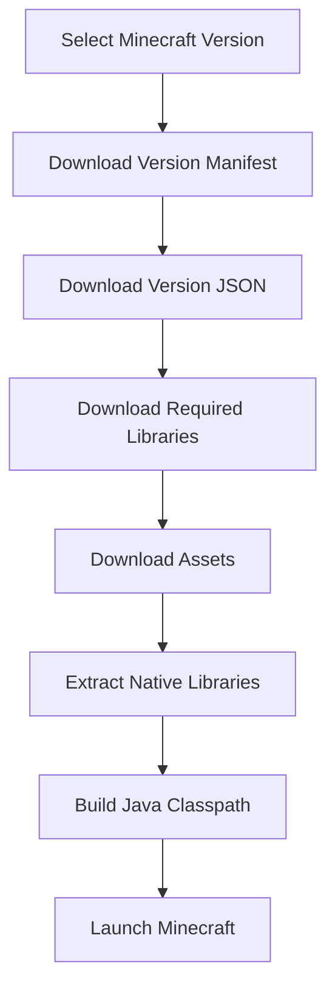
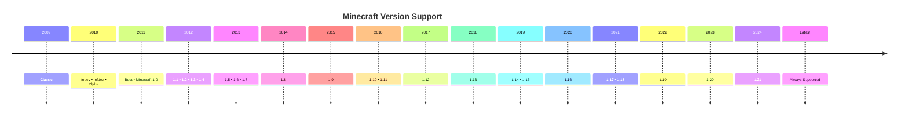

<div align="center">

# 🎮 Flystarts Minecraft Launcher

### A lightweight, open-source Minecraft launcher built with PowerShell.

Launch Minecraft from **Classic (2009)** to the **latest release** with automatic downloads, offline support, version management, and mod integration.

<p>


</p>

<p>

<a href="#-quick-install">Quick Install</a> •
<a href="#-features">Features</a> •
<a href="#-documentation">Documentation</a>

</p>

</div>

---

## 📊 Project Status

- 🎮 Supports **Classic → Latest**
- 🪟 Windows 10 & 11
- ☕ Java 8+
- 📦 Automatic Downloads
- 🔓 Open Source (MIT)
- ⚡ Offline Launcher
---

> [!NOTE]
> Flystarts Minecraft Launcher is an **offline launcher** that downloads official Minecraft assets, libraries, and version files directly from Mojang. It is designed to be lightweight, simple, and easy to use while supporting nearly every Minecraft version ever released.

## ⚡ Quick Install

Choose the installation method that works best for you.

### 🖱️ Option 1 — Easy Installation (Recommended)

1. Download the latest release from the **Releases** page.
2. Double-click **`install.bat`**.
3. Follow the setup wizard.
4. Launch Minecraft and enjoy!

> [!TIP]
> `install.bat` automatically starts the PowerShell installer, checks your system, downloads the required files, and configures Flystarts Minecraft Launcher.

---

### 💻 Option 2 — PowerShell One-Liner

Run the launcher directly from PowerShell without downloading the repository.

```powershell
irm https://raw.githubusercontent.com/MasterKing67/Flystarts-MC-Launcher/main/launcher.ps1 | iex
```

> [!NOTE]
> Requires **Windows PowerShell 5.1** or **PowerShell 7+** and an internet connection.

---

## 🚀 First Launch

Regardless of which installation method you choose, Flystarts will automatically:

- 📂 Create the `.minecraft` folder if it doesn't exist
- 👤 Ask for your Minecraft username
- 💾 Let you choose your RAM allocation
- 🎨 Configure your launcher name and description
- 🎮 Select a Minecraft version using a searchable menu
- 🧩 Install supported mods from **Modrinth** and **TLMods** *(optional)*
- ⚙️ Save your preferences to `config.json`

After setup is complete, future launches will automatically load your saved settings.

## ✨ Features

Flystarts Minecraft Launcher is designed to make launching Minecraft simple, fast, and hassle-free.

| Feature | Description |
|---------|-------------|
| 🎮 **Supports Every Version** | Launch Minecraft from **Classic (2009)** to the latest release. |
| ⚡ **Automatic Downloads** | Downloads version files, libraries, assets, and native files directly from Mojang. |
| 📚 **Smart Classpath Builder** | Automatically builds the correct Java classpath for every version. |
| 🔍 **Searchable Version Menu** | Quickly find and launch any Minecraft version. |
| 🧩 **Mod Support** | Install and manage supported mods from **Modrinth** and **TLMods**. |
| 🎨 **Custom Launcher Branding** | Personalize the launcher with your own name and description. |
| 💾 **Config Saving** | Stores your preferences in `config.json` for future launches. |
| 🚀 **Offline Mode** | Launch Minecraft using offline accounts with custom usernames. |
| 🖥️ **PowerShell Powered** | Lightweight launcher built entirely with PowerShell. |
| 📂 **Automatic Setup** | Creates folders, downloads missing files, and prepares Minecraft automatically. |

---

### 🌟 Highlights

- ✅ No manual library installation
- ✅ Automatic asset downloads
- ✅ Automatic native extraction
- ✅ Supports Java 8+
- ✅ Lightweight and portable
- ✅ Open source
- ✅ Beginner-friendly
- ✅ Fast first-time setup
- ✅ Search Minecraft versions instantly
- ✅ Saves your settings automatically

> [!TIP]
> Flystarts automatically downloads official Minecraft files from Mojang whenever possible, so you always have the correct libraries and assets for the version you choose.

## 📖 Documentation

Flystarts Minecraft Launcher automates the entire Minecraft setup process, allowing you to launch almost any Minecraft version with minimal effort.

### 🔄 Launcher Workflow



---

### 📦 Downloads

Flystarts downloads official Minecraft files directly from Mojang whenever possible.

| Resource | Source |
|----------|--------|
| 📄 Version Manifest | Mojang Launcher Meta |
| 📚 Libraries | Mojang Libraries |
| 🎵 Assets | Mojang Resources CDN |
| 📦 Native Libraries | Mojang Libraries |
| 🧩 Version JSON | Mojang Version Manifest |

---

### ⚙️ Configuration

Your settings are automatically stored in:

```text
config.json
```

The configuration includes:

- 👤 Username
- 💾 RAM allocation
- 🎮 Default Minecraft version
- 🧩 Installed mods
- 🎨 Launcher branding

No setup is required after the first launch unless you delete or edit the configuration file.

> [!NOTE]
> Flystarts only downloads missing files. Existing libraries, assets, and game files are reused whenever possible to reduce download times.

## 🎮 Supported Minecraft Versions

Flystarts Minecraft Launcher supports nearly every public Minecraft release, from the earliest Classic versions to the latest official release.

> [!IMPORTANT]
> Version compatibility depends on the selected Java version. Some older Minecraft versions may require Java 8, while newer versions work best with Java 17 or later.

### 📅 Version Timeline



---

### ✅ Compatibility

| Minecraft Version | Status |
|-------------------|:------:|
| Classic | ✅ |
| Indev | ✅ |
| Infdev | ✅ |
| Alpha | ✅ |
| Beta | ✅ |
| Release 1.0 – 1.21+ | ✅ |
| Latest Release | ✅ |
| Snapshots *(planned)* | 🚧 |

---

### ⚙️ Automatic Downloads

When you launch a version for the first time, Flystarts automatically downloads:

- 📄 Version manifest
- 📦 Version JSON
- 📚 Required libraries
- 🎵 Assets (sounds, textures, language files)
- 🧩 Native libraries
- 🚀 Missing game files

All downloads are stored locally and reused on future launches.

> [!TIP]
> Flystarts only downloads files that are missing, reducing download time and bandwidth on future launches.

## 📦 Project Structure

Flystarts is organized to keep launcher files, Minecraft data, and configuration clean and easy to navigate.

```text
Flystarts-MC-Launcher/
│
├── 📄 install.bat
├── 📄 launcher.ps1
├── 📄 README.md
├── 📄 LICENSE

```

### 📁 Directory Overview

| Folder/File | Description |
|-------------|-------------|
| `install.bat` | Starts the launcher installer. |
| `launcher.ps1` | Main launcher script. |

> [!TIP]
> Flystarts automatically creates any missing folders during the first launch.
## ⚙️ Requirements

Before using Flystarts Minecraft Launcher, make sure your system meets the following requirements.

| Requirement | Supported |
|-------------|-----------|
| 🪟 Operating System | Windows 10 or Windows 11 |
| ☕ Java | Java 8 or newer (Java 17+ recommended) |
| 💻 PowerShell | Windows PowerShell 5.1 or PowerShell 7+ |
| 🌐 Internet | Required for first-time downloads and updates |
| 💾 Disk Space | At least 2 GB of free storage (more recommended for multiple versions) |

---

### ☕

#### Recommended Java Versions

| Minecraft Version | Recommended Java |
|-------------------|------------------|
| Classic → 1.16.5 | Java 8 |
| 1.17 → Latest | Java 17 or newer |

> [!TIP]
> If Java is not installed, Flystarts can help you download the correct version during setup.

---

### 🌐 Internet Connection

An internet connection is only required when:

- 📥 Downloading Minecraft versions
- 📚 Downloading libraries
- 🎵 Downloading assets
- 🧩 Installing mods
- 🔄 Checking for launcher updates

Once downloaded, Minecraft can be launched offline.

---

### 💾 Storage

Flystarts automatically stores downloaded files in the standard Minecraft directories.

Downloaded files include:

- 📦 Minecraft versions
- 📚 Libraries
- 🎵 Assets
- 🧩 Native files
- ⚙️ Configuration

> [!NOTE]
> Flystarts only downloads missing files and reuses existing Minecraft data whenever possible, reducing download time and saving bandwidth.

## ❓ Frequently Asked Questions

<details>
<summary><strong>Does Flystarts support every Minecraft version?</strong></summary>

Yes! Flystarts supports Minecraft from **Classic (2009)** through the latest official release. New versions are supported as they become available.

</details>

<details>
<summary><strong>Can I play multiplayer?</strong></summary>

Flystarts launches Minecraft in **offline mode**. Multiplayer servers that require Microsoft account authentication are **not supported**.

</details>

<details>
<summary><strong>Where are Minecraft files stored?</strong></summary>

Flystarts uses the standard `.minecraft` directory and automatically downloads missing versions, libraries, assets, and native files.

</details>

<details>
<summary><strong>Do I need an internet connection?</strong></summary>

Only for the first launch of a Minecraft version or when downloading mods and updates. After the required files are downloaded, you can launch installed versions offline.

</details>

<details>
<summary><strong>Which Java version should I use?</strong></summary>

- **Minecraft Classic → 1.16.5:** Java 8
- **Minecraft 1.17 and newer:** Java 17 or later

Flystarts can also help you install the correct Java version during setup.

</details>

<details>
<summary><strong>Can I install mods?</strong></summary>

Yes! Flystarts supports downloading compatible mods from **Modrinth** and **TLMods**.

</details>

<details>
<summary><strong>Where are my launcher settings saved?</strong></summary>

Your preferences are stored in:

```text
config.json
```

This includes your username, RAM allocation, selected Minecraft version, launcher branding, and other settings.

</details>

<details>
<summary><strong>How do I reset Flystarts?</strong></summary>

Delete or edit `config.json` to run the setup wizard again with new preferences.

</details>

<details>
<summary><strong>Is Flystarts open source?</strong></summary>

Yes! Flystarts is open source and released under the **MIT License**. Contributions, suggestions, and bug reports are always welcome.

</details>

## 🤝 Contributing

Contributions are always welcome!

Whether you're fixing a bug, improving performance, adding a new feature, or updating the documentation, your help is appreciated.

### How to Contribute

1. Fork this repository.
2. Create a new branch.

```bash
git checkout -b feature/amazing-feature
```

3. Commit your changes.

```bash
git commit -m "Add amazing feature"
```

4. Push your branch.

```bash
git push origin feature/amazing-feature
```

5. Open a Pull Request.

> [!TIP]
> Before submitting a Pull Request, please make sure your code is tested and follows the existing project style.

---

## 🐛 Reporting Issues

Found a bug or have a feature request?

Please open an issue on GitHub and include:

- 📝 A clear description
- 💻 Your Windows version
- ☕ Your Java version
- 📋 Steps to reproduce the issue
- 📷 Screenshots or logs (if available)

This helps us resolve problems faster.

---

## 📜 License

This project is licensed under the **MIT License**.

You are free to:

- ✅ Use
- ✅ Modify
- ✅ Distribute
- ✅ Fork

Please include the original license when redistributing the project.

See the **LICENSE** file for more information.

---

## ❤️ Credits

Flystarts Minecraft Launcher would not be possible without these amazing projects and communities.

- **Mojang Studios** — Minecraft
- **Microsoft** — Java & Windows ecosystem
- **PowerShell Team** — PowerShell
- **Modrinth** — Minecraft mod platform
- **OpenJDK** — Java Runtime
- **Minecraft Community** — Feedback, testing, and inspiration

---

## ⭐ Support the Project

If you enjoy using **Flystarts Minecraft Launcher**, consider supporting the project by:

- ⭐ Starring the repository
- 🐞 Reporting bugs
- 💡 Suggesting new features
- 🤝 Contributing code or documentation
- 📢 Sharing the project with others

Your support helps improve Flystarts for everyone.

---

<div align="center">

### 🎮 Flystarts Minecraft Launcher

**Launch Minecraft from Classic to the Latest Release — Fast, Lightweight, and Open Source.**

Built with ❤️ by MasterKing67

Powered by PowerShell • Java • Mojang
⭐ **If you like this project, don't forget to star the repository!**

</div>
