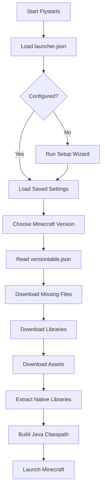
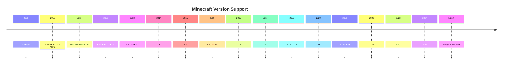

<div align="center">


# 🎮 Flystarts Minecraft Launcher

### A modern, lightweight, open-source Minecraft launcher built with PowerShell.

Launch Minecraft from **Classic (2009)** to the **latest release** with automatic downloads, offline support, and version management.

<div align="center">


<br>


</div>
<a href="#-quick-install">⚡ Quick Install</a> •
<a href="#-features">✨ Features</a> •
<a href="#-documentation">📖 Documentation</a> •
<a href="#-supported-minecraft-versions">🎮 Versions</a> •
<a href="#-faq">❓ FAQ</a>

</div>

---

## 📊 Project Status

| Status | Value |
|:-------|:------|
| 🚀 Development | **Active** |
| 🎮 Supported Versions | **Classic → Latest** |
| 🪟 Platform | **Windows 10 / 11** |
| ☕ Java | **Java 8+** |
| 💻 Language | **PowerShell** |
| 🔓 License | **MIT** |
| 📦 Installation | **Portable or AppData** |
| 🌐 Downloads | **Official Mojang Sources** |

> [!NOTE]
> Flystarts Minecraft Launcher is an **offline launcher** that downloads official Minecraft assets, libraries, and version files directly from Mojang. It is designed to be lightweight, simple, and easy to use while supporting nearly every Minecraft version ever released.

# ⚡ Quick Install

Choose the installation method that works best for you.

<table>
<tr>
<td width="50%" align="center">

## 🖱️ Option 1

### Download & Install

The easiest way to get started.

1. Download the latest release.
2. Extract the ZIP file.
3. Double-click **`install.bat`**.
4. Complete the setup wizard.
5. Launch Minecraft.

</td>

<td width="50%" align="center">

## 💻 Option 2

### PowerShell

Run directly without downloading the repository.

```powershell
irm https://raw.githubusercontent.com/MasterKing67/Flystarts-MC-Launcher/main/launcher.ps1 | iex
```

</td>
</tr>
</table>

> [!TIP]
> Both installation methods automatically download required files, configure the launcher, and prepare Minecraft for your first launch.

---

## 🚀 First Launch

During the initial setup, Flystarts will automatically:

- 📂 Create the Minecraft directory
- 👤 Ask for your username
- 💾 Configure RAM allocation
- 🎨 Set launcher name and description
- 🎮 Select a Minecraft version
- 🧩 Install supported mods *(optional)*
- ⚙️ Save your settings to `launcher.json`

Once setup is complete, Flystarts remembers your preferences for future launches.

# ✨ Features

<table>
<tr>
<td width="50%">

### 🎮 Minecraft

- Supports **Classic → Latest**
- Searchable version selector
- Automatic version downloads
- Offline launcher
- Portable or AppData installation

</td>

<td width="50%">

### ⚙️ Launcher

- Custom launcher branding
- Saved settings (`launcher.json`)
- Configurable RAM allocation
- Automatic updates *(planned)*
- Detailed logging

</td>
</tr>

<tr>
<td width="50%">

### 📦 Downloads

- Official Mojang downloads
- Automatic library downloads
- Automatic asset downloads
- Native library extraction
- Retry failed downloads

</td>

<td width="50%">

### 🧩 Extras

- Modrinth support
- TLMods support
- PowerShell based
- Lightweight
- Open Source (MIT)

</td>
</tr>
</table>

---

## 🌟 Highlights

- 🎮 Launch Minecraft from **Classic (2009)** to the latest release
- ⚡ Lightweight PowerShell launcher
- 📦 Downloads official Minecraft files automatically
- 💾 Saves your preferences for future launches
- 🧩 Optional mod support
- 🔓 Fully open source

> [!TIP]
> Flystarts only downloads missing files and reuses existing libraries and assets whenever possible, making future launches much faster.

# 📖 Documentation

Flystarts automates the Minecraft installation process, handling downloads, configuration, and launching so you can start playing with minimal setup.

---

## 🔄 Launcher Workflow



---

## 📥 Downloads

Flystarts downloads official Minecraft files automatically when required.

| Resource | Description |
|----------|-------------|
| 📄 Version Manifest | Version information |
| 📚 Libraries | Required Java libraries |
| 🎵 Assets | Sounds, textures, language files |
| 📦 Client JAR | Minecraft client |
| 🧩 Native Libraries | Platform-specific files |

> [!NOTE]
> Existing files are reused whenever possible to reduce download times.

---

## ⚙️ Configuration

Launcher settings are stored in:

```text
launcher.json
```

The configuration includes:

- 👤 Username
- 💾 RAM allocation
- 🎨 Launcher name
- 📝 Launcher description
- 📂 Minecraft installation location
- 🎮 Last selected version

---

## 📝 Logging

Flystarts records launcher activity in:

```text
launcher.log
```

The log includes:

- Download progress
- Configuration changes
- Launch commands
- Error messages
- Debug information

> [!TIP]
> If you encounter an issue, attach `launcher.log` when reporting a bug to help diagnose the problem faster.

# 🎮 Supported Minecraft Versions

Flystarts Minecraft Launcher supports nearly every public Minecraft release, from the earliest Classic versions to the latest official release.

---

## 📅 Version Timeline



---

## ✅ Compatibility

| Minecraft Version | Status |
|:------------------|:------:|
| Classic | ✅ |
| Indev | ✅ |
| Infdev | ✅ |
| Alpha | ✅ |
| Beta | ✅ |
| Release 1.0 – Latest | ✅ |
| Snapshots | 🚧 Planned |

---

## 📥 Automatic Downloads

Flystarts automatically downloads everything needed for the selected version.

- 📄 Version metadata
- 📦 Client JAR
- 📚 Java libraries
- 🎵 Assets
- 🧩 Native libraries
- ⚙️ Missing dependencies

> [!TIP]
> Files are downloaded only once and reused on future launches.

# 📦 Project Structure

Flystarts is organized to keep launcher files, configuration, and Minecraft data clean and easy to manage.

```text
Flystarts-MC-Launcher/
│
├── 📄 install.bat
├── 📄 launcher.ps1
├── 📄 launcher.json
├── 📄 versiontable.json
├── 📄 launcher.log
├── 📄 README.md
├── 📄 LICENSE
```
> [!NOTE]
> Missing folders are created automatically during the first launch.

# ⚙️ Requirements

Before using Flystarts Minecraft Launcher, make sure your system meets the following requirements.

| Requirement | Supported |
|-------------|-----------|
| 🪟 Operating System | Windows 10 / 11 |
| ☕ Java | Java 8 or newer (Java 17+ recommended) |
| 💻 PowerShell | Windows PowerShell 5.1 or PowerShell 7+ |
| 🌐 Internet | Required for first-time downloads |
| 💾 Storage | At least 2 GB free space |

---

## ☕

### Recommended Java Versions

| Minecraft Version | Java Version |
|-------------------|--------------|
| Classic → 1.16.5 | Java 8 |
| 1.17 → Latest | Java 17+ |

> [!TIP]
> Flystarts automatically uses your installed Java version. If Java is missing, you'll be prompted to install it.

# ❓ Frequently Asked Questions

<details>
<summary><strong>Does Flystarts support every Minecraft version?</strong></summary>

Yes. Flystarts supports Minecraft from **Classic (2009)** to the latest official release listed in `versiontable.json`.

</details>

<details>
<summary><strong>Can I play multiplayer?</strong></summary>

Flystarts is an **offline launcher**. Servers that require Microsoft account authentication are not supported.

</details>

<details>
<summary><strong>Where are my settings saved?</strong></summary>

All launcher settings are stored in:

```text
launcher.json
```

</details>

<details>
<summary><strong>Can I install mods?</strong></summary>

Yes. Flystarts supports downloading compatible mods from **Modrinth** and **TLMods**.

</details>

<details>
<summary><strong>Do I need an internet connection?</strong></summary>

Only when downloading Minecraft versions, libraries, assets, or mods for the first time.

</details>

<details>
<summary><strong>How do I reset the launcher?</strong></summary>

Delete `launcher.json` and restart Flystarts to run the setup wizard again.

</details>

<details>
<summary><strong>Where are log files stored?</strong></summary>

Launcher activity is saved in:

```text
launcher.log
```

</details>

# 🤝 Contributing

Contributions are welcome!

Whether you're fixing bugs, improving documentation, or adding new features, your help is appreciated.

## Getting Started

1. Fork this repository.
2. Create a new branch.

```bash
git checkout -b feature/my-feature
```

3. Commit your changes.

```bash
git commit -m "Add my feature"
```

4. Push your branch.

```bash
git push origin feature/my-feature
```

5. Open a Pull Request.

---

## Reporting Issues

If you find a bug, please include:

- Windows version
- Java version
- PowerShell version
- Launcher log (`launcher.log`)
- Steps to reproduce the issue

This helps us fix problems more quickly.

> [!TIP]
> Before opening a Pull Request, please test your changes and ensure they don't break existing functionality.

# ❤️ Credits

Flystarts Minecraft Launcher is made possible thanks to these projects and communities.

| Project | Description |
|---------|-------------|
| 🎮 Mojang Studios | Minecraft |
| 🪟 Microsoft | Windows & PowerShell |
| ☕ OpenJDK | Java Runtime |
| 📦 Modrinth | Minecraft mods |
| ❤️ Open Source Community | Inspiration and contributions |

---

<div align="center">

# 🎮 Flystarts Minecraft Launcher

### Fast • Lightweight • Open Source

Built with ❤️ by **MasterKing67**

⭐ **If you like this project, please consider giving it a star!**

[⬆ Back to Top](#-flystarts-minecraft-launcher)

</div>
